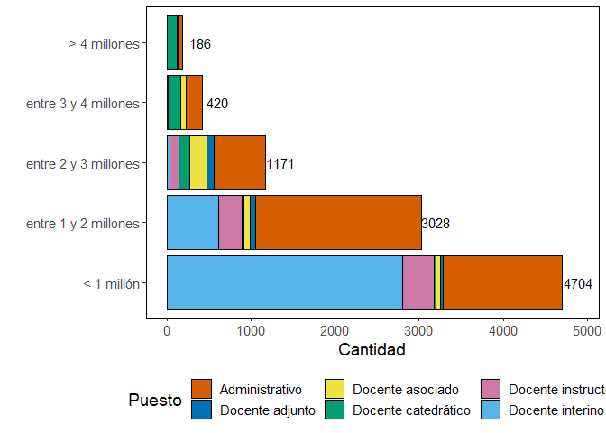

# **¿Cómo se usa el FEES en la UCR?**

*Asociación de Estudiantes de Química*
*Esteban Bertsch-Aguilar*

---

La lucha por el FEES ha creado una serie de narrativas para poner en duda los méritos de las Universidades Públicas. Los principales argumentos consisten en:

- Las universidades contratan demasiado personal, comparado a los estudiantes que tienen.
- Las universidades le otorgan salarios excesivos a su personal.
- La mayoría del presupuesto del FEES se va en esos salarios excesivos.

---

En este documento vamos a explorar las bases de datos de la U para ver varias cosas:

- ¿Cuántxs estudiantes entran a la U?
- ¿Cuánto personal se contrata en la U?
- ¿Cómo se distribuye el salario entre funcionarixs?


Para ello, vamos a usar las bases de datos de la UCR (disponibles en transparencia.ucr.ac.cr) y haremos un análisis **100% basado en datos**.


## **1. Estudiantes vs Funcionarixs**

Vamos a cargar las bases de datos de estudiantes matriculadxs y la planilla de la UCR.


```r
rm(list = ls())
library(tidyverse)
```

```
## Warning: package 'tidyverse' was built under R version 4.1.3
```

```
## Warning: package 'tibble' was built under R version 4.1.3
```

```
## Warning: package 'forcats' was built under R version 4.1.3
```

```
## -- Attaching core tidyverse packages ------------------------ tidyverse 2.0.0 --
## v dplyr     1.1.4     v readr     2.1.5
## v forcats   1.0.0     v stringr   1.5.1
## v ggplot2   3.4.4     v tibble    3.2.1
## v lubridate 1.9.3     v tidyr     1.1.4
## v purrr     0.3.4     
## -- Conflicts ------------------------------------------ tidyverse_conflicts() --
## x dplyr::filter() masks stats::filter()
## x dplyr::lag()    masks stats::lag()
## i Use the conflicted package (<http://conflicted.r-lib.org/>) to force all conflicts to become errors
```

```r
#cargar tablas de estudiantes matriculados
estudiantes <- read.csv("https://transparencia.ucr.ac.cr/medios/documentos/2020/estudiantes-fi%CC%81sicos-matri%CC%81culados.csv",fileEncoding='latin1',check.names=F, sep = ';')
estudiantes <- replace(estudiantes, is.na(estudiantes),0)

n_estudiantes <- sum(estudiantes$`2019/I Ciclo/Estudiantes físicos`) #¿cuántos estudiantes matricularon en el primer semestre del 2019?


#cargar tabla de planilla de la UCR en abril 2024
funcionarios <- read.csv("https://transparencia.ucr.ac.cr/medios/documentos/2024/planilla-2024-04.csv", sep = ';')


funcionarios$puesto <- ifelse(grepl('PROFESOR',funcionarios$ï..PUESTO) == TRUE,
                              'Docente',
                              'Administrativo')


docentes <- funcionarios %>% filter(puesto == 'Docente')
n_docentes <- nrow(docentes)

administrativos <- funcionarios %>% filter(puesto == 'Administrativo')
n_administrativos <- nrow(administrativos)
```


```r
df <- data.frame('Nombre' = c('Estudiantes', 'Docentes', 'Administrativos'),
                 'n' = c(n_estudiantes, n_docentes, n_administrativos))


ggplot(df) + 
  geom_col(aes(x = n, y = Nombre, fill = Nombre),
           color = 'black') + 
  theme(panel.background = element_blank(),
        panel.border = element_rect(fill = NA, color = 'black'),
        axis.text = element_text(size = 13),
        legend.position = 'none') + 
  labs(x = '', y = '') + 
  scale_fill_manual(values = c('red4', 'gold3', 'blue4')) + 
  annotate('text', x = 35000, y = 3, label = paste(n_estudiantes,'estudiantes'), color = 'white', size = 5) + 
  annotate('text', x = 13400, y = 2, label = paste(n_docentes,'docentes'), size = 5) + 
  annotate('text', x = 13000, y = 1, label = paste(n_administrativos,'administrativos'), size = 5)
```

<!-- -->

Esto significa que por cada **estudiante matriculado**, hay **0.12 docentes** en la universidad.

Similarmente, por cada **estudiante matriculado**, hay **0.09 administrativos** en la universidad.


---

## 2. Hablemos de salarios

Una de las principales críticas hacia las universidades públicas consiste en el salario de sus funcionarios. La opinión pública prevalece que los salarios dentro de las universidades son excesivamente altos.

La UCR brinda una base de datos cada mes con todos los puestos y salarios de toda la planilla de la universidad. Indaguemos en la realidad salarial del país. Para ello, vamos a usar la planilla a mitad de semestre, en abril 2024 (*para que estén incluidos los profes interinos, quienes se les quita el nombramiento cada final de semestre*).


```r
#función para encontrar la moda
get_mode <- function(x) {
  unique_x <- unique(x)
  unique_x[which.max(tabulate(match(x, unique_x)))]
}

promedio <- round(mean(funcionarios$SALARIO),0)
moda <- round(get_mode(funcionarios$SALARIO),0)


ggplot(funcionarios) + 
  geom_histogram(aes(x = SALARIO), color = 'black', fill = 'cyan4', bins = 40) + 
  geom_vline(xintercept = promedio, linewidth = 1) + 
  geom_vline(xintercept = moda, linewidth = 1) +
  labs(x = 'Salarios', y = 'Cantidad') + 
  theme(panel.background = element_blank(),
        panel.border = element_rect(fill = NA, color = 'black'),
        text = element_text(size = 14),
        legend.position = 'none')
```

<!-- -->

```r
print(paste0("El salario promedio en la UCR es ₡",promedio))
```

```
## [1] "El salario promedio en la UCR es ¢1231043"
```

```r
print(paste0("El salario más común en la UCR es ₡",moda ))
```

```
## [1] "El salario más común en la UCR es ¢212228"
```


Con ello, podemos ver una realidad más objetiva con los salarios asignados en la U. ¿Por qué el salario más común es tan bajo? Una gran parte de funcionarios de la UCR (approx. 1000) no están nombrados a tiempo completo. Veamos con más detalle cómo se distribuyen esas pagas dependiendo del puesto.


```r
#separación más específica por puesto

for(i in 1:nrow(funcionarios)){
  if(grepl('INTERINO',funcionarios$ï..PUESTO[i]) == TRUE){
    funcionarios$puesto[i] <- 'Docente interino'
  } else if(grepl('ADJUNTO',funcionarios$ï..PUESTO[i]) == TRUE){
    funcionarios$puesto[i] <- 'Docente adjunto'
  } else if(grepl('INSTRUCTOR',funcionarios$ï..PUESTO[i]) == TRUE){
    funcionarios$puesto[i] <- 'Docente instructor'
  } else if(grepl('ASOCIADO',funcionarios$ï..PUESTO[i]) == TRUE){
    funcionarios$puesto[i] <- 'Docente asociado'
  } else if(grepl('CATEDRATICO',funcionarios$ï..PUESTO[i]) == TRUE){
    funcionarios$puesto[i] <- 'Docente catedrático'
  } else {funcionarios$puesto[i] <- 'Administrativo'}
}


cantidad <- table(funcionarios$puesto)


ggplot(funcionarios) + 
  geom_violin(aes(x = SALARIO, y = puesto, fill = puesto)) + 
  geom_boxplot(aes(x = SALARIO, y = puesto, fill = puesto), shape = 19, width = 0.1, linewidth = 0.7, color = 'black') + 
    geom_violin(aes(x = SALARIO, y = puesto), fill = NA) + 
  theme(panel.background = element_blank(),
        panel.border = element_rect(fill = NA, color = 'black'),
        text = element_text(size = 14),
        legend.position = 'none') + 
  labs(y = 'Puesto', x = 'Salario') + 
  scale_fill_manual(values = c('#D55E00', '#0072B2', '#F0E442', '#009E73', '#CC79A7', '#56B4E9')) + 
  annotate('text', x = 7.9e6, y = 1, label = cantidad[[1]], size = 4) + 
  annotate('text', x = 3.6e6, y = 2, label = cantidad[[2]], size = 4) +
  annotate('text', x = 4.4e6, y = 3, label = cantidad[[3]], size = 4) +
  annotate('text', x = 9e6, y = 4, label = cantidad[[4]], size = 4) +
  annotate('text', x = 3.3e6, y = 5, label = cantidad[[5]], size = 4) +
  annotate('text', x = 6.5e6, y = 6, label = cantidad[[6]], size = 4)
```

<!-- -->


